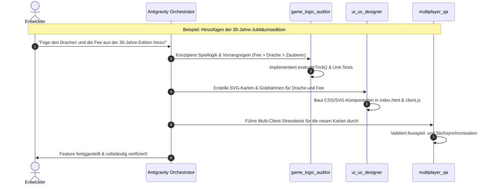

# Wizard Online – Subagenten & Experten-Flotte

Diese Datei dokumentiert die spezialisierten Subagenten, die für das Projekt **Wizard Online** konzipiert und eingerichtet wurden. Sie unterstützen den Entwickler und den Haupt-Agenten bei gezielten Aufgaben, Qualitätsprüfungen und Funktionserweiterungen.

---

## Übersicht der Subagenten

| Subagent | Rolle | Hauptverantwortung | Wichtigste Dateien |
| :--- | :--- | :--- | :--- |
| **`game_logic_auditor`** | Wizard-Regelwerk, Engine & Sondereditionen | Mathematische Regeltreue, Sonderkarten, 30-Jahre-Jubiläumsedition | `server/gameLogic.js`, `test/gameLogic.test.js` |
| **`multiplayer_qa`** | Concurrency & Netzwerk-Stresstests | Socket.IO Stresstests, Raum-Isolierung, Verbindungsabbruch & Reconnect | `server/index.js`, `test/*.test.js` |
| **`ui_ux_designer`** | Frontend, Mobile & Editions-Artwork | Responsive CSS, Fächer-Layout, Touch-Gesten, SVG-Replikation der Editionen | `public/index.html`, `public/client.js`, `public/images/` |
| **`security_auditor`** | Cheat-Schutz & Härtung | Zero-Trust Servervalidierung, XSS-Schutz, Session-Integrität | `server/index.js`, `public/client.js` |
| **`bot_developer`** | KI-Gegner & Solo-Modus | Biet- & Spielheuristiken, Bot-Integration im Warteraum | `server/botLogic.js`, `server/index.js` |

---

## Detaillierte Agentenprofile

### 1. `game_logic_auditor`
* **Aufgabe**: Stellt sicher, dass alle Regeln des Wizard-Kartenspiels exakt eingehalten werden, und konzipiert Erweiterungen für Sondereditionen.
* **Kernkompetenzen**:
  - **Klassische Regeln**: Bedienpflicht (Farbzwang), Sonderregeln für Zauberer & Narren, Geber-Regel (Plus/Minus Eins), Punkteberechnung (+20/+10 vs. -10 pro Stich Abweichung), Kartensortierung nach Trumpffarbe.
  - **Sondereditionen (z. B. 30 Jahre Jubiläumsedition)**:
    - Drache (schlägt Zauberer)
    - Fee (unterliegt allen, schlägt aber den Drachen)
    - Bombe (neutralisiert den Stich)
    - Werwolf, Hexe, Vampir, Wolke, Jongleur, Gestaltenwandler
  - **Modulare Regelsätze**: Ermöglicht Umschalten zwischen `classic` und `anniversary_30` ohne Code-Duplikate.
  - **Unit-Tests**: Verifiziert alle Kantenfälle mit Node.js Assertions.

---

### 2. `multiplayer_qa`
* **Aufgabe**: Validiert das Echtzeitverhalten und die Ausfallsicherheit unter hoher Last oder instabilen Netzwerkbedingungen.
* **Kernkompetenzen**:
  - **Multi-Client-Simulation**: Startet parallele Sockets in Testläufen und prüft synchrone Zustandswechsel.
  - **Raum-Isolierung**: Garantiert, dass 6-stellige Zahlencodes kollisionsfrei bleiben und keine Daten in fremde Spielräume gelangen.
  - **Disconnect & Reconnect**: Simuliert Verbindungsverluste während Bietphasen oder Stichen, prüft Pausen-Overlays und Reconnects über `sessionId`.
  - **Leave-Handling & Cleanup**: Stellt sicher, dass das Verlassen von Spielern die Runde sauber neu austeilt oder bei < 3 Spielern in den Warteraum zurückführt, ohne Server-Timer oder Speicherlecks zu hinterlassen.

---

### 3. `ui_ux_designer`
* **Aufgabe**: Gestaltet die grafische Oberfläche und optimiert das Spielerlebnis auf Desktop, Tablet und Smartphone.
* **Kernkompetenzen**:
  - **Responsive Layouts**: Desktop-Kartenfächer mit dynamischem Negativ-Spacing und Hover-Lift; Mobile "Tap to Inspect"-Interaktion.
  - **Visuelle Eleganz**: Subtile, warm-goldene Tisch-Aura für Zugindikatoren; zentrierte Bietmasken mit freiem Blick auf Hand und Trumpf; Slide-Out Drawer ("Block der Wahrheit").
  - **Editions-Studium & Replikation**:
    - Analysiert die grafischen Stile offizieller Wizard-Editionen (z. B. 30 Jahre Jubiläumsedition mit Goldverzierungen und Runen).
    - Erstellt gestochen scharfe Vektorgrafiken (SVGs) für Sonderkarten wie Drache, Fee und Bombe passend zum Dark-Fantasy-Design.
  - **AAA 3D-Karten- & Spielraum-Animationen**:
    - Studiert Physik- und Animations-Pipelines führender Online-Kartenspiele (Hearthstone, MTG Arena, Legends of Runeterra).
    - Entwickelt 3D-Flip- und Flugbahnen (`transform-style: preserve-3d`, Bezier-Arcs, Z-Elevation-Schatten, dynamische Lichtreflexe).
    - Erschafft immersive Raum-Hintergründe (Lobby-Portal, Warteraum-Ratskammer, Spielraum-Zauberturmgewölbe).

---

### 4. `security_auditor`
* **Aufgabe**: Prüft die Anwendung auf Schwachstellen und stellt sicher, dass der Server die alleinige Autorität über den Spielzustand behält.
* **Kernkompetenzen**:
  - **Zero-Trust-Validierung**: Verhindert, dass Clients Karten spielen, die sie nicht besitzen, oder Züge außerhalb ihrer Runde ausführen.
  - **Input-Sanitization**: Bereinigt Namen und Raumcodes gegen XSS- und Injection-Angriffe.
  - **Regel-Enforcement**: Blockiert manipulierte Gebote (z. B. verbotene Geber-Gebote oder negative Zahlen) direkt auf Serverebene.

---

### 5. `bot_developer`
* **Aufgabe**: Haucht virtuellen Gegnern Leben ein, damit Partien jederzeit auch solo oder zu zweit gespielt werden können.
* **Kernkompetenzen**:
  - **Biet-Heuristik**: Berechnet Stichchancen basierend auf Handstärke, Zauberern, Trumpffarben und Spieleranzahl.
  - **Taktische Stichführung**: Kennt den Unterschied zwischen "Stich machen müssen" und "Stiche abtreten wollen", bedient Farben optimal.
  - **Lobby-Integration**: Ermöglicht dem Host, Bots per Klick hinzuzufügen, um sofort starten zu können.

---

## Zusammenarbeit der Agenten (Workflow-Beispiel)

